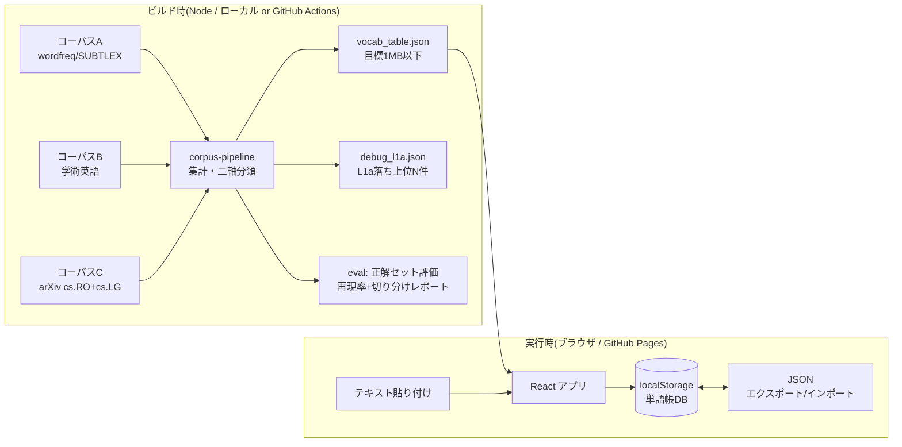
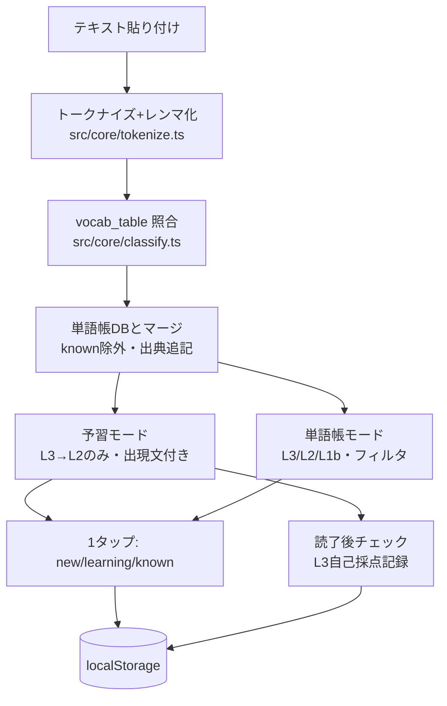
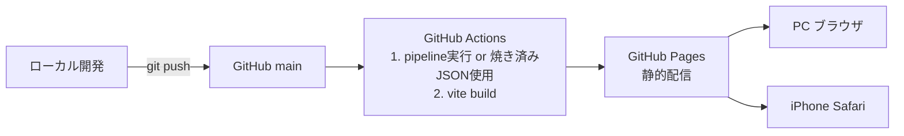

# 設計 (Phase 1) — architecture.md

最終更新: 2026-08-13
前提: `docs/requirements.md`。L3判定アルゴリズムの詳細は `docs/algorithm.md` に分離。

## 1. 全体構成

システムは「ビルド時パイプライン(Node)」と「実行時アプリ(ブラウザ)」の2つに完全分離する。重い計算・大きいデータはすべてビルド時。ブラウザは焼き込み済みJSONを引くだけ。



## 2. データフロー(実行時)



要点:
- **文書内の出現文抽出**は実行時に行う(貼られたテキストから該当語を含む文を1つ拾う)。vocab_table には文書非依存の情報(レベル、分野語義、一般語義との対比、日本語訳)だけを焼く
- 出現回数は抽出の閾値に使わない(ソート補助と表示のみ)

## 3. モジュール分割

```
word-learning/
├── pipeline/               # ビルド時(Node + TypeScript, tsx実行)
│   ├── fetch/              # コーパス取得スクリプト(A/B/C)
│   ├── compute/            # 頻度・共起統計、二軸分類(詳細は algorithm.md)
│   ├── bake.ts             # vocab_table.json + debug_l1a.json 生成
│   └── eval/               # 正解セット評価(再現率・取りこぼし切り分け)
├── public/data/
│   └── vocab_table.json    # 焼き込み済み語彙表(配信物)
├── src/
│   ├── core/
│   │   ├── tokenize.ts     # トークナイズ+レンマ化(レンマ表はvocab_tableに同梱)
│   │   ├── classify.ts     # 照合とレベル付与・文書内出現文抽出
│   │   └── types.ts        # VocabEntry / WordbookEntry 等の型定義
│   ├── store/
│   │   ├── wordbook.ts     # localStorage 単語帳DB(CRUD、上限処理)
│   │   └── io.ts           # JSONエクスポート/インポート(将来CSVもここ)
│   ├── ui/
│   │   ├── InputView.tsx   # テキスト貼り付け
│   │   ├── PrestudyView.tsx    # 予習モード
│   │   ├── WordbookView.tsx    # 単語帳モード
│   │   └── PostReadCheck.tsx   # 読了後チェック(Phase 2で入らなければPhase 3)
│   └── App.tsx
└── docs/
```

依存方向: `ui → store/core → types`。core はDOMに依存しない純関数(テスト容易性のため)。pipeline と src は vocab_table.json のスキーマ(types.ts を共有)だけで接続。

## 4. データ設計

### 4.1 vocab_table.json(ビルド時産物、配信)

```jsonc
{
  "version": 1,
  "domain": "cs.RO+cs.LG",
  "entries": {
    "kernel": {
      "level": "L3",            // "L3" | "L2" | "L1b"(L1aは含めない=サイズ削減)
      "domainSense": "a function measuring similarity between data points (SVM/GP context)",
      "contrast": "not the seed/core of a nut — in ML it's a similarity function",
      "ja": "カーネル(類似度関数)",     // トグル表示用
      "score": 0.82              // 横軸スコア(ソート用、詳細は algorithm.md)
    }
  },
  "lemma": { "kernels": "kernel", "denoted": "denote" }   // 変化形→見出し語
}
```

- L1a語はテーブルに**含めない**ことでサイズを稼ぐ(未収載=L1a扱い)。復活パス通過語はL3としてテーブルに入るので実行時に区別不要
- `lemma` 表はビルド時に生成し同梱(ブラウザに形態素解析器を持ち込まない。サイズと精度のトレードオフは algorithm.md §レンマ化 参照)
- gzip配信前提で目標1MB以下(GitHub Pagesは自動gzip/brotli)

### 4.2 単語帳DB(localStorage)

```jsonc
{
  "schemaVersion": 1,
  "words": {
    "kernel": {
      "status": "learning",         // "new" | "learning" | "known"
      "level": "L3",
      "sources": [                   // 出典配列(重複エントリを作らない)
        { "docId": "doc_001", "title": "...(先頭50字)", "count": 4, "sentence": "..." }
      ],
      "selfCheck": [                 // 読了後チェックの記録
        { "docId": "doc_001", "correct": true, "at": "2026-08-13" }
      ],
      "updatedAt": "2026-08-13"
    }
  },
  "docs": { "doc_001": { "title": "...", "addedAt": "2026-08-13", "l3Count": 12 } }
}
```

- キーは見出し語(レンマ)。CSV(Anki)展開可能なフラット構造
- **上限時の挙動**: 保存前に容量を試算し、閾値(4MB)超過で警告バナー+エクスポート促し。`sources` は語ごとに直近10文書まで(超過分は古い順に `count` へ集約して文情報を落とす)。保存失敗(QuotaExceededError)時はメモリ上で継続し、エクスポートを強制提案

## 5. 技術選定と理由

| 選定 | 理由 | 却下した代替 |
|---|---|---|
| React | 情報量が最多でWeb経験が薄くても詰まりにくい。コンポーネント分割が2モードUIと合う | Svelte/Vue(情報量で劣後)、素のTS(UI状態管理を手書きする負担) |
| Vite | dev起動が速い。`base` 設定だけでGitHub Pagesに静的ビルドを置ける | CRA(非推奨化)、Next.js(SSR不要。静的サイトに過剰) |
| TypeScript | vocab_table / 単語帳のスキーマを型で固定し、pipeline と src で共有できる | JS(データ構造中心のアプリで型なしはバグ源) |
| Tailwind CSS | モバイル対応(レスポンシブ)をユーティリティで最短実装。CSS設計不要 | CSS Modules(設計負担)、UIライブラリ(過剰) |
| 状態管理: useState/useContext のみ | 指示。画面2枚+リストで足りる | Redux/Zustand 等は導入しない |
| pipeline: Node + tsx | types.ts をフロントと共有。ビルド時だけ動けばよい | Python(型共有できず2言語運用になる。コーパス取得のみ必要ならその箇所だけ許容) |
| localStorage | 同期API・実装最小。単語帳は数千語規模でテキストのみなので容量内 | IndexedDB(非同期・コード量増。localStorage逼迫が実測されたら移行) |
| GitHub Actions → Pages | push で pipeline 実行〜デプロイまで自動化。無料枠内 | 手動デプロイ(再現性がない) |

初期セットアップの具体手順は Phase 2 着手時に `docs/setup_frontend.md` として作成する(Q10)。

## 6. デプロイ構成



- コーパス生データはリポジトリに入れない(サイズ・ライセンス)。`vocab_table.json` はビルド産物としてコミットする方針(Actionsでのコーパス再取得を毎回やらない。再生成はローカルで明示実行)
- Pages は `main` ブランチ + Actions デプロイ。プロジェクトページ(`/word-learning/`)前提で Vite の `base` を設定

## 7. リスクと対策

| # | リスク | 影響 | 対策 |
|---|---|---|---|
| 1 | L3検出精度が出ない(最重要) | 製品価値の消滅(「ただの単語ハイライター」化) | algorithm.md で手法比較→Phase 2冒頭でPoC評価を先行。正解セット20語・再現率70%・取りこぼし切り分けで定量判断 |
| 2 | コーパスのライセンス/入手性 | 配信不可・作り直し | 集計値のみ配信(生データ再配布しない)。ライセンス確認は algorithm.md のコーパス調査に含める |
| 3 | 語義説明(domainSense/contrast)の静的生成の質 | L3の価値が伝わらない | 正解セット近傍の重要語は手書き優先。不足が確認できたら(c)ハイブリッドへ(順序厳守) |
| 4 | レンマ化の精度(ブラウザ内) | 照合漏れ→抽出漏れ | ビルド時生成のレンマ表で主要変化形をカバー。評価スクリプトで照合漏れも計測 |
| 5 | vocab_table のサイズ超過 | 上限5MB違反 | L1a非収載・語義文の文字数上限・gzip実測をpipelineでチェック(超過でビルド失敗させる) |
| 6 | localStorage 逼迫・消失 | 蓄積資産の喪失 | §4.2 の上限設計 + JSONエクスポート/インポート(Phase 2 必須) |
| 7 | 個人開発の時間切れ | 完成しない | Phase 2 は「貼る→リストが出る」を最優先。読了後チェックは落としてよい唯一の候補(Phase 3送り可) |

## 8. Phase 2 実装順(提案)

1. pipeline 最小版: コーパス取得→頻度統計→二軸分類→vocab_table.json(算法は algorithm.md の最小構成)
2. 評価スクリプト+正解セット20語で精度確認 ← **ここで一度レビュー(精度が出なければUIに進まない)**
3. フロント骨格: 貼り付け→照合→予習リスト表示
4. 単語帳DB+3値ステータス+2モードUI
5. JSONエクスポート/インポート
6. arXiv abstract 3本で実地検証 → レビュー
