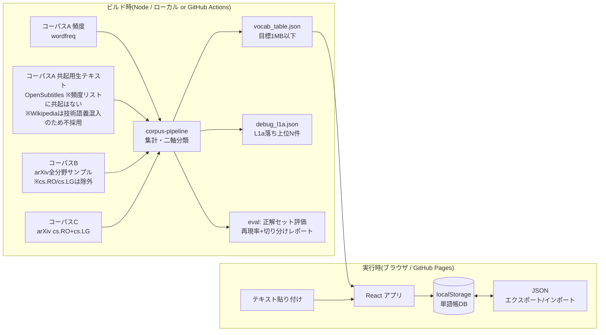
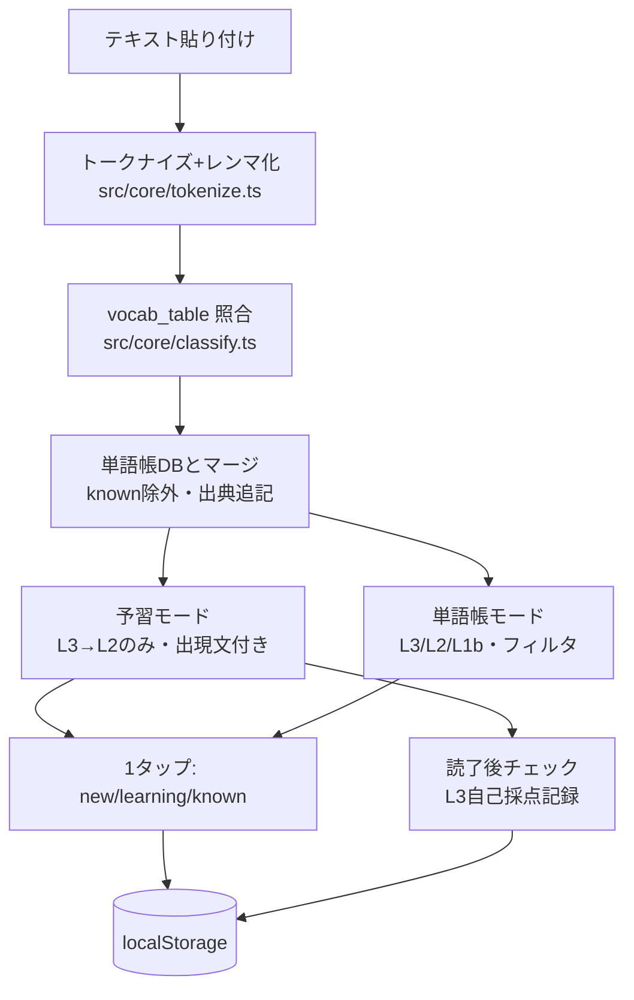
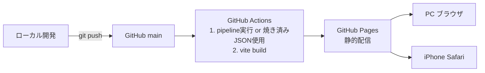

# 設計 (Phase 1) — architecture.md

最終更新: 2026-08-13
前提: `docs/requirements.md`。L3判定アルゴリズムの詳細は `docs/algorithm.md` に分離。

## 1. 全体構成

システムは「ビルド時パイプライン(Node)」と「実行時アプリ(ブラウザ)」の2つに完全分離する。重い計算・大きいデータはすべてビルド時。ブラウザは焼き込み済みJSONを引くだけ。



## 2. データフロー(実行時)



要点:
- **文書内の出現文抽出**は実行時に行う(貼られたテキストから該当語を含む文を1つ拾う)。vocab_table には文書非依存の情報(レベル、分野語義、一般語義との対比、日本語訳)だけを焼く
- 出現回数は抽出の閾値に使わない(ソート補助と表示のみ)

## 3. モジュール分割

```
word-learning/
├── pipeline/               # ビルド時(Node + TypeScript, tsx実行)
│   ├── fetch/              # コーパス取得スクリプト(A/B/C)
│   ├── compute/            # 頻度・共起統計、二軸分類(詳細は algorithm.md)
│   ├── bake.ts             # vocab_table.json + debug_l1a.json 生成
│   └── eval/               # 正解セット評価(再現率・取りこぼし切り分け)
├── public/data/
│   └── vocab_table.json    # 焼き込み済み語彙表(配信物)
├── src/
│   ├── core/
│   │   ├── tokenize.ts     # 前処理+トークナイズ+レンマ表照合(方針は§3.1)
│   │   ├── classify.ts     # 照合とレベル付与・文書内出現文抽出
│   │   └── types.ts        # VocabEntry / WordbookEntry 等の型定義
│   ├── store/
│   │   ├── wordbook.ts     # localStorage 単語帳DB(CRUD、上限処理)
│   │   └── io.ts           # JSONエクスポート/インポート(将来CSVもここ)
│   ├── ui/
│   │   ├── InputView.tsx   # テキスト貼り付け
│   │   ├── PrestudyView.tsx    # 予習モード
│   │   ├── WordbookView.tsx    # 単語帳モード
│   │   └── PostReadCheck.tsx   # 読了後チェック(Phase 2で入らなければPhase 3)
│   └── App.tsx
└── docs/
```

依存方向: `ui → store/core → types`。core はDOMに依存しない純関数(テスト容易性のため)。pipeline と src は vocab_table.json のスキーマ(types.ts を共有)だけで接続。

### 3.1 テキスト前処理・トークナイズ方針(pipeline と実行時で共通)

- **LaTeX前処理**: arXiv abstract には `$...$`(数式)、`\alpha` 等のコマンド、`\citep{}` 等のマクロが混入する。トークナイズ前段で「インライン数式・LaTeXコマンド・引用マクロの除去」を行う(`mathcal`, `textbf` 等がゴミ語として分類対象に入るのを防ぐ)。pipeline のコーパス前処理と実行時の貼り付けテキスト前処理で同じ実装を共有する
- **ユニグラムのみ**: フレーズ・複合語(loss function, support vector)は Phase 2 非スコープ(設計判断として明示。二軸モデルはユニグラム前提)
- **小文字化**して照合(文頭大文字と固有名詞の区別は Phase 2 では行わない)
- **ハイフン語**(model-free, closed-loop): まず1トークンとして照合し、レンマ表未収載ならハイフン分割して各要素で再照合
- **レンマ化**: ブラウザに形態素解析器を持ち込まず、ビルド時に **wink-lemmatizer**(Node)で候補語の変化形を展開したレンマ表を vocab_table に同梱。**英米綴りの正規化**(behaviour→behavior, optimise→optimize)もレンマ表に含める
- **照合漏れの計測**: 評価スクリプトと実行時デバッグで「入力トークンのレンマ表未ヒット率」をログ出力し、レンマ表の被覆不足を検出可能にする

## 4. データ設計

### 4.1 vocab_table.json(ビルド時産物、配信)

```jsonc
{
  "version": 1,
  "domain": "cs.RO+cs.LG",
  "entries": {
    "kernel": {
      "level": "L3",            // "L3" | "L2" | "L1b"(L1aは含めない=サイズ削減)
                                 // 型は拡張可能に定義: Phase 3 で "L3-academic" を追加できる形(実装はしない)
      "domainSense": "a function measuring similarity between data points (SVM/GP context)",
      "contrast": "not the seed/core of a nut — in ML it's a similarity function",
      "ja": "カーネル(類似度関数)",     // トグル表示用
      "score": 0.82,             // 合成危険度スコア(ソート用。合成式は algorithm.md §3)
      "collGeneral": ["corn", "seed", "truth"],           // 一般英語での共起(説明素材)
      "collField": ["function", "gaussian", "svm"]        // 分野での共起(説明素材)
    }
  },
  "lemma": { "kernels": "kernel", "denoted": "denote" }   // 変化形→見出し語
}
```

- L1a語はテーブルに**含めない**ことでサイズを稼ぐ(未収載=L1a扱い)。復活パス通過語はL3としてテーブルに入るので実行時に区別不要
- `lemma` 表はビルド時に生成し同梱(ブラウザに形態素解析器を持ち込まない。サイズと精度のトレードオフは algorithm.md §レンマ化 参照)
- gzip配信前提で目標1MB以下(GitHub Pagesは自動gzip/brotli)

### 4.2 単語帳DB(localStorage)

```jsonc
{
  "schemaVersion": 1,
  "words": {
    "kernel": {
      "status": "learning",         // "new" | "learning" | "known"
      "level": "L3",
      "sources": [                   // 出典配列(重複エントリを作らない)
        { "docId": "doc_001", "title": "...(先頭50字)", "count": 4, "sentence": "..." }
      ],
      "selfCheck": [                 // 読了後チェックの記録
        { "docId": "doc_001", "correct": true, "at": "2026-08-13" }
      ],
      "updatedAt": "2026-08-13"
    }
  },
  "docs": { "doc_001": { "title": "...", "addedAt": "2026-08-13", "l3Count": 12 } }
}
```

- キーは見出し語(レンマ)。CSV(Anki)展開可能なフラット構造
- **docId は正規化テキストの内容ハッシュ**(例: SHA-256 先頭12桁)。同一文書の再貼付を同一視し、count / sources の水増し(重複エントリ)を防ぐ
- **インポートはマージ**(置換ではない): 語単位で `sources` を docId で和集合、`count` は同一docIdなら大きい方、`status` はより進んだ方(new < learning < known)を採用。復旧(全消失後のインポート)もマージで自然に成立する
- **上限時の挙動**: 保存前に容量を試算し、閾値(4MB)超過で警告バナー+エクスポート促し。`sources` は語ごとに直近10文書まで(超過分は古い順に `count` へ集約して文情報を落とす)。保存失敗(QuotaExceededError)時はメモリ上で継続し、エクスポートを強制提案
- **iOS Safari の ITP リスク**: 7日間無操作で localStorage が消去され得る(主ターゲット端末で核心資産が上限超過なしでも消える経路)。対策: 初回利用時と定期(例: 文書5本ごと)のエクスポート促し。恒久対策として将来PWA化を検討

## 5. 技術選定と理由

| 選定 | 理由 | 却下した代替 |
|---|---|---|
| React | 情報量が最多でWeb経験が薄くても詰まりにくい。コンポーネント分割が2モードUIと合う | Svelte/Vue(情報量で劣後)、素のTS(UI状態管理を手書きする負担) |
| Vite | dev起動が速い。`base` 設定だけでGitHub Pagesに静的ビルドを置ける | CRA(非推奨化)、Next.js(SSR不要。静的サイトに過剰) |
| TypeScript | vocab_table / 単語帳のスキーマを型で固定し、pipeline と src で共有できる | JS(データ構造中心のアプリで型なしはバグ源) |
| Tailwind CSS | モバイル対応(レスポンシブ)をユーティリティで最短実装。CSS設計不要 | CSS Modules(設計負担)、UIライブラリ(過剰) |
| 状態管理: useState/useContext のみ | 指示。画面2枚+リストで足りる | Redux/Zustand 等は導入しない |
| pipeline: Node + tsx | types.ts をフロントと共有。ビルド時だけ動けばよい | Python(型共有できず2言語運用になる。コーパス取得のみ必要ならその箇所だけ許容) |
| localStorage | 同期API・実装最小。単語帳は数千語規模でテキストのみなので容量内 | IndexedDB(非同期・コード量増。localStorage逼迫が実測されたら移行) |
| GitHub Actions → Pages | push で pipeline 実行〜デプロイまで自動化。無料枠内 | 手動デプロイ(再現性がない) |

初期セットアップの具体手順は Phase 2 着手時に `docs/setup_frontend.md` として作成する(Q10)。

## 6. デプロイ構成



- コーパス生データはリポジトリに入れない(サイズ・ライセンス)。`vocab_table.json` はビルド産物としてコミットする方針(Actionsでのコーパス再取得を毎回やらない。再生成はローカルで明示実行)
- Pages は `main` ブランチ + Actions デプロイ。プロジェクトページ(`/word-learning/`)前提で Vite の `base` を設定

## 7. リスクと対策

| # | リスク | 影響 | 対策 |
|---|---|---|---|
| 1 | L3検出精度が出ない(最重要) | 製品価値の消滅(「ただの単語ハイライター」化) | algorithm.md で手法比較→Phase 2冒頭でPoC評価を先行。正解セット20語・再現率70%・取りこぼし切り分けで定量判断 |
| 2 | コーパスのライセンス/入手性 | 配信不可・作り直し | 集計値のみ配信(生データ再配布しない)。ライセンス確認は algorithm.md のコーパス調査に含める |
| 3 | 語義説明(domainSense/contrast)の静的生成の質 | L3の価値が伝わらない | 正解セット近傍の重要語は手書き優先。不足が確認できたら(c)ハイブリッドへ(順序厳守) |
| 4 | レンマ化の精度(ブラウザ内) | 照合漏れ→抽出漏れ | ビルド時生成のレンマ表で主要変化形をカバー。評価スクリプトで照合漏れも計測 |
| 5 | vocab_table のサイズ超過 | 上限5MB違反 | L1a非収載・語義文の文字数上限・gzip実測をpipelineでチェック(超過でビルド失敗させる) |
| 6 | localStorage 逼迫・消失 | 蓄積資産の喪失 | §4.2 の上限設計 + JSONエクスポート/インポート(Phase 2 必須) |
| 7 | 個人開発の時間切れ | 完成しない | Phase 2 を 2a(エンジン+評価)/ 2b(最小UI)/ 2c(蓄積・保全)に分割し、各段が単独で動く・測れる状態にする(requirements §8)。読了後チェックは最小版(○/×1タップ)を 2c に残す(主指標の計測装置のため落とさない) |
| 8 | iOS Safari ITP による localStorage 消去 | 蓄積資産の喪失(上限超過なしでも) | §4.2 のエクスポート促し。将来PWA化 |

## 7.1 Phase 3 候補: R/L 別統計(2026-08-13 記録。今は実装しない)

**同一の根本原因に紐づく3つの兆候**(1本のCコーパスで cs.RO 系と cs.LG 系の両語義を測ろうとしていることが原因。統計手法の限界ではない — Phase 2a レビュー判断2の訂正):

1. **mass のピン**: R重心構成で物理質量が支配語義になり、確率質量の信号が消滅(data/senses.yaml の pinReason 参照)
2. **R-L 束ね検証 49.9%**: 基準(<50%)ぎりぎり。「通った」ではなく「次で落ちる」と読む(発注者判断)
3. **sound の挙動**: C構成によって L1a⇔L3 を行き来する(音響語彙の混入比率に判定が依存)

**対処案**: C を R / L の2系統統計に分割し、語義信号を max(senseShift_R, senseShift_L) で取る(どちらかの分野で語義がズレれば危険語)。ピンの pinReason に「R/L別統計で再判定」と書かれた語が自動検出に戻れるかが導入時の検証項目。**次に同種の問題が出たら実装判断する**(発注者指示)。

**追記(2026-08-13 Phase 2a クローズ時): より一般化した根本原因** — 上記に加え ⚑ 診断で判明した prior(「prior work」形容詞用法が一般隣人を保存し rgRel=0.069)を含め、**「rgRel / keyness / 共起分布が語単位で計算されていることによる、多義語の信号消滅」**が共通の根:
1. **mass**: C内で物理質量/確率質量が併存 → 頻度信号消滅(→ピンで対処中)
2. **prior**: C内で形容詞用法/事前分布が併存 → rgRel 消滅(→⚑誤爆の主因)
3. **temperature**(潜在): C内で物理温度/softmax温度が併存しうる
対処は**承認済みの語義単位スキーマ**(proposal_sense_schema.md)の延長線上にあり、Phase 3 でこの根を叩く際に R/L 別統計と合わせて一括解決するかを判断する(発注者指示)。

## 7.2 Phase 2b 設計事項: 語幹グルーピング表示(発見3、phase2a_gate_result.md)

precision@50 で50枠中9枠が同一語幹の変化形(navigation/navigate/navigating 等)に消費された。予習モード上限20語では約2割の枠が重複で潰れる計算。

- **抽出は表層形のまま**(単純レンマ化は禁止: demonstration=L3妥当 / demonstrate=学術一般 のように判定が割れており、統合すると妥当な方が消える)
- **表示側で同一語幹をグルーピング**: 代表語1つを主表示、変化形は折りたたみ。上限20語のカウントはグループ単位
- 代表語の選び方(スコア最大 or 出現回数最大)は 2b の設計判断。語幹判定は保守的に(vocab_table の lemma 表 + 派生接辞の限定セット)
- **known の単位は表層形**(2026-08-13 承認): demonstration既知/demonstrate未知は起こりうるし、判定が割れる語(learned/learn)でグループ単位knownは片方を取りこぼす。**表示はグループ、状態は表層形** — 語義単位スキーマと同じ「表示と状態の粒度分離」構造
- ⚑(topicRisk)は**デフォルト非表示・設定で表示可能**として実装(適合率30%のため「話題語疑い」表示は保留。承認済み)
- **開閉ログと読了後チェックの連携**(phase2b_ui_review.md 修正3): 予習中に日本語訳を開いた語を `docs[docId].opened[]` に記録(実装済み)。ステータスの自動変更はしない(開かなかった=既知とは限らない)。**読了後チェック画面(2b残)は opened の語を優先的に確認対象として先頭に出す** — 「開いた語=読中に誤読リスクが高かった語」の自己採点効率を上げる
- **語義修正のUI導線**(Phase 2c 以降。実地検証1本目の conditioning 誤りを受けた発注者指示): 生成語義7,437語の全数検品は不可能で、**使いながら直す運用**が前提になる。読書中に誤りを見つけたら**その場で** senses.yaml 相当の修正を追記できる導線をUIに置く(その場でメモできないと後で思い出せない — この導線の有無が実用性を左右する)。実装案: 語義表示に「修正」ボタン → 修正テキストを localStorage に保存し即時表示に反映 + senses.yaml 形式でエクスポートできる「修正キュー」画面 → 発注者が senses.yaml に貼り付けて確定(手書き優先の既存機構に乗せる。ビルド不要の即時反映と、恒久化の二段構え)

## 7.3 Phase 3 候補: L1b の定義見直し(2026-08-13 記録。今は触らない — 発注者指示)

単語帳の L1b 層(862語)は現状精度が低い。実地3本での妥当語は respectively / primarily / explicitly / approximately 級のみで、以下の3診断が根拠:

1. **θb の z膨張**: kBA は log-odds z であり、巨大コーパスでは微小な効果量でも z が巨大化する(two: A率1083ppm→B率1700ppm の1.57倍で z=48)。z分位点では「学術文体語」と「頻度がわずかに寄った日常語」を分離できない。見直すなら効果量(B/A率比)の下限を併用
2. **cache の zipf ミスマッチ**: wordfreq zipf(Web混みで3.63)が高頻度プールに送るが、実際の A(字幕)では cntA=12。プール判定の頻度源と共起の頻度源が乖離しており、cache は L2 ルート(低頻度プール専用)に到達できず L1b に落ちた。主題語のレベル判定が外れる実害あり
3. **state の既知度**: 読者既知語が L1b に貯まる。既知度軸(known マーキング)で処理されるべき層の混入

閾値調整では 1・2 の両方は直らないため**定義から見直す**(Phase 3)。それまで実害は「単語帳に貯まる語の質」のみ(予習モードに L1b は出ない)。単語帳UIの L1b 表示に精度注記を出して誤解を防ぐ(実装済み)。

**関連(同日発見)**: 人名由来の専門語(Gaussian / Bayesian / Jacobian / Markovian / Lagrangian — ほぼ常に大文字)が**コーパス層の大文字率フィルタで固有名詞として除外**され、vocab_table に存在しない(Gaussian: C内2,203回・小文字率0.1%)。発注者要求は「L2として出したい」。対処候補: (a) -ian/-ean 語尾の人名形容詞をフィルタ除外条件から免除、(b) senses.yaml ピンで個別収載。判定層のため凍結 — Phase 3 の L4/固有名詞設計と併せて判断。

## 8. Phase 2 実装順(requirements §8 の 2a/2b/2c に対応)

1. **[2a]** pipeline 最小版: コーパス調達(A共起=OpenSubtitles、B/C=Kaggle arXiv)→前処理→2信号+話題語ガード→vocab_table.json
2. **[2a]** 評価スクリプト+正解セット20語+負例 → 話題語混入率の実測 → **評価ゲート(再現率≥70% AND precision@50≥60%)。ここで一度レビュー。通過までUIに進まない**
3. **[2b]** フロント骨格: 貼り付け→前処理・照合→L3/L2リスト表示(単一画面)
4. **[2b]** arXiv abstract 3本で実地検証 → レビュー
5. **[2c]** 単語帳DB+3値ステータス+2モードUI
6. **[2c]** JSONエクスポート/インポート+読了後チェック最小版
